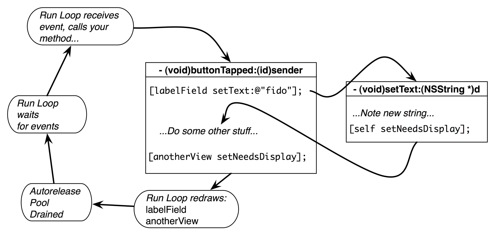

# The View Drawing Cycle 

## 官方文档的描述

官方文档一共有多个地方提到了The View Drawing Cycle; 现列出具体的出处:

### 1 View Programming Guide for iOS

链接地址：
https://developer.apple.com/library/ios/documentation/WindowsViews/Conceptual/ViewPG_iPhoneOS/WindowsandViews/WindowsandViews.html#//apple_ref/doc/uid/TP40009503-CH2-SW9

对应章节：
The View Drawing Cycle

核心内容：
These methods tell the system that the contents of the view changed and need to be redrawn at the next opportunity. **The system waits until the end of the current run loop before initiating any drawing operations.**

### 2 Drawing and Printing Guide for iOS

链接地址: 
https://developer.apple.com/library/ios/documentation/2DDrawing/Conceptual/DrawingPrintingiOS/GraphicsDrawingOverview/GraphicsDrawingOverview.html

对应章节：
The View Drawing Cycle

核心内容：
主要是介绍了有几个Action会触发view的update, 包括显示调用setNeedsDisplay.
**There are several actions that can trigger a view update:**

**After calling your drawRect: method, the view marks itself as updated and waits for new actions to arrive and trigger another update cycle.**

### 3 View Programming Guide for iOS
链接地址：
https://developer.apple.com/library/ios/documentation/WindowsViews/Conceptual/ViewPG_iPhoneOS/CreatingViews/CreatingViews.html#//apple_ref/doc/uid/TP40009503-CH5-SW3

对应章节：
Implementing Your Drawing Code

核心内容：
主要是给了一个drawRect的例子；
另：And if your drawRect: method might be called frequently, you should do everything you can to optimize your drawing code and draw as little as possible each time the method is called.

### 4  UIView Class Reference
链接地址：
https://developer.apple.com/library/ios/documentation/UIKit/Reference/UIView_Class/

对应章节：
The View Drawing Cycle

核心内容：
就是手动调用setNeedsDisplay，这样下一个绘制周期就知道要重绘了.

You do this by calling your view’s setNeedsDisplay or setNeedsDisplayInRect: method of the view. **These methods let the system know that it should update the view during the next drawing cycle**. Because it waits until the next drawing cycle to update the view, you can call these methods on multiple views to update them at the same time.

## WWDC的描述

session_238__ios_app_performance_graphics_and_animations.pdf (不确定，需要再次整理与确定)

## 其他文章解读与讨论

### 1 Redrawing and UIScrollView

http://www.jianshu.com/p/14e2a1f1051e

这里面主要是提供了一张图比较便于理解绘制流程。

### 2 讨论：“In iOS, is there a relationship between run loop and display refresh?”

http://stackoverflow.com/questions/15015821/in-ios-is-there-a-relationship-between-run-loop-and-display-refresh

问题是关于run loop和display refresh是否存在对应关系

回答：
a The system waits until the end of the current run loop before initiating any drawing operations （来自官方文档）
b Apple has a very good WWDC 2012 video describing in detail what happens **at the end of each run loop when the current CATransaction commits and drawing happens and animations begin**.

### 3 文章 Redraw Moment

在上面的讨论之后有个链接，给出了概念叫做redraw moment

http://www.apeth.com/iOSBook/ch17.html#_drawing_animation_and_threading

可以在文中搜索这个“redraw moment”，这个redraw moment可以帮助理解绘制周期；最后再去探讨这个redraw moment究竟发生在什么时候.
结论性的观点是认为，发生在CATransaction Commit之后，实际上是在run loop结束的时候.

 